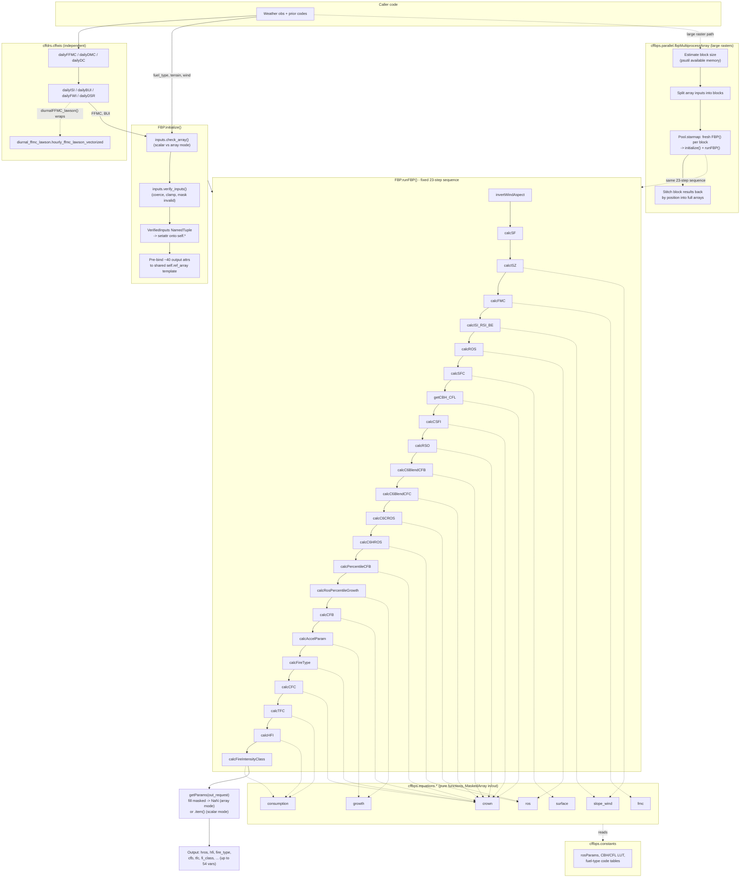

# cffdrs — Codebase Reference

Python implementation of the Canadian Forest Fire Danger Rating System: the Fire
Behaviour Prediction (FBP) System and the Fire Weather Index (FWI) System. Library
only — no server, no CLI, no event handlers. Scalar and NumPy-array inputs share
one API; missing/NoData values propagate via masked arrays. `uv`-managed, PyPI-bound,
version derived from git tags (hatch-vcs).

## Architecture overview

Two independent systems live side by side in one package:

- **`cffdrs.cffbps`** (FBP) — a facade class (`FBP`) that orchestrates pure,
  single-purpose equation functions in a fixed sequence. Facade holds no fire-behavior
  math itself; equation submodules never call across files — all wiring between
  quantities (e.g. crown fraction burned feeding into fuel consumption) happens in
  the facade's hardcoded call order.
- **`cffdrs.cffwis`** (FWI) — flat, independent module functions (no shared class).
  Legacy/untyped style, predates the `cffbps` typing conventions. Not called by
  `cffbps` internally — FBP takes FFMC/BUI as caller-supplied inputs.
- **`cffdrs.diurnal_ffmc_lawson`** — a separate hourly-FFMC algorithm (table
  interpolation from a daily 1200 FFMC), wrapped by `cffwis.diurnalFFMC_lawson()`.
  Unrelated to `cffwis.hourlyFFMC()` (Van Wagner/Alexander recursive model) — two
  independent hourly-FFMC methods coexist.

The codebase is a genuine two-tier system, not just old-vs-new file age:

| Tier | Files | Typing | Error handling |
|---|---|---|---|
| Modern, strict-mypy-gated | `cffbps/equations/*`, `cffbps/constants.py`, `_typing.py` | Fully typed, `from __future__ import annotations`, reST docstrings | `TypeError`/`ValueError` only for structural problems; domain issues handled via masking/clipping/`np.errstate` |
| Modern, typed but ungated | `cffbps/facade.py`, `cffbps/inputs.py`, `cffbps/parallel.py` | Typed, excluded from strict mypy (dynamic dict access, masked-array narrowing fights numpy stubs) | Same masking-first philosophy as equations |
| Legacy/untyped | `cffwis.py`, `diurnal_ffmc_lawson.py` | Bypasses `_typing.py` entirely | Manual `isinstance` checks repeated per parameter, per function |

## Key files and responsibilities

### `cffbps/facade.py` (~930 lines) — the `FBP` class
- `initialize(...)` — accepts fuel/terrain/weather inputs (scalar or ndarray), calls
  `inputs.check_array()` then `inputs.verify_inputs()`, pre-binds ~40 output attributes
  to one shared zero-filled `self.ref_array` template, raises `ValueError` if any of
  the 11 required params is missing.
- `runFBP()` — guards on `self.initialized`, runs 18 `calcX()` steps in a fixed
  hardcoded order, returns `self.getParams(out_request)`. Also validates the final
  `out_request` list against `constants.valid_outputs` and raises `ValueError` naming
  any unknown entries (documented via a `:raises:` line on the method).
- `calcX()` methods (one per equation-module function) — thin wrappers: read `self.*`,
  call one `equations.*` function, write result(s) back to `self.*`. Contract: return
  value field names must match facade attribute names (enforced by comment convention,
  not by code).
- `getParams(out_request)` — builds a ~50-key dict of every possible output, returns
  the requested subset; branches once on scalar-vs-array mode to unwrap results.
- `getSeasonGrassCuring(...)` — standalone lookup helper, not tied to an instance.

### `cffbps/inputs.py` — validation/coercion
Pure functions, no mutation of shared state. `check_array()` detects scalar-vs-array
mode and validates all array inputs share one shape. `_coerce()` wraps a single
value as a masked array (NaN → default for pc/pdf/gfl/gcf, NaN → masked for
everything else — deliberate, golden-snapshot-locked behavior). `verify_inputs()` is
the main entry, returns a `VerifiedInputs` NamedTuple whose field names match `FBP`
attributes by contract.

### `cffbps/parallel.py` — multiprocessing driver
`fbpMultiprocessArray(...)`: estimates block size from available memory
(`psutil`) and processor count, splits array inputs into non-overlapping blocks,
runs a fresh `FBP()` per block via `multiprocessing.Pool.starmap` (return-value
based, no shared memory/queues), stitches block results back into full output
arrays by position. `num_processors < 2` is bumped to 2 with a `warnings.warn(...)`
(not a `print()`); an invalid `out_request` raises inside the worker's `runFBP()`
call and propagates cleanly back out through `pool.starmap`, not swallowed.

### `cffbps/constants.py` — static lookup tables
Fuel-type code tables (numeric ↔ alpha), `valid_outputs`, per-fuel-type CBH/CFL/height
table, per-fuel-type ROS coefficients (`rosParams`), open/non-crowning fuel-type sets.
Wrapped immutable (`MappingProxyType`/`tuple`/`Final`). `facade.__init__` copies these
into per-instance mutable attributes so one instance can be calibrated without
affecting others or the shared module table.

### `cffbps/equations/*` — pure calculation functions
One file per concern, all operating on `numpy.ma.MaskedArray` only (no separate
scalar path — scalars are coerced upstream):
- `slope_wind.py` — wind/slope geometry, zero-wind ISI, wind/slope-adjusted ISI, RSI, BUI effect
- `ros.py` — head/backing rate of spread, D2 handling, and separate C6 CROS/HROS equations
- `surface.py` — surface fuel consumption (one formula per fuel type/group)
- `crown.py` — CBH/CFL, CSFI, RSO, directional/temporary C6 blend CFB, fire type, CFC
- `consumption.py` — total fuel consumption, HFI, fire intensity class
- `fmc.py` — foliar moisture content and effect
- `growth.py` — growth-percentile ROS adjustment, point-ignition acceleration

Multi-value returns use `NamedTuple`s (`FMCResult`, `SlopeWindISI`, `ISIRSIBEResult`)
whose field names double as the facade attribute contract.

**`growth.calc_ros_percentile_growth`'s statistical basis.** Adjusts `hros`/`bros`
for a requested `percentile_growth` (0-100, no-op at 50) using the variance-stabilized
ROS quantile model of Han, L. & Braun, W.J. (2014), "Dionysus: a stochastic fire
growth scenario generator", *Environmetrics* 25(6):431-442 — traced from the WISE
C++ codebase (`Percentile.cpp`'s `ScenarioPercentile::RSI`, `excel_tinv.cpp`) back
to its published source. Below the crowning threshold (`cfb < 0.1`) ROS
residuals are treated as log-normal and scaled by
`exp(tinv * sigma_surface)`; at or above it, a closed-form Box-Cox power-law
adjustment (`delta=0.6`, the paper's fitted crown-fire transform) applies, falling
back to the same log-normal form if its radicand goes negative. `sigma_surface`/
`sigma_crown` are per-fuel-type fitted noise standard deviations (only 9 fuel
types have them: C1-C7, D1, M3); `tinv` is a standard-normal quantile computed via
`scipy.stats.t.ppf` at `freedom=9999999` (numerically indistinguishable from
normal). `hros` and `bros` each use their own pre-percentile directional CFB for
the surface-vs-crown decision (`facade.py`'s `self.percentile_cfb`/
`self.percentile_bros_cfb`), and
`bros`'s noise term is additionally scaled by a wind-speed decay factor `k(wsv)`
(the paper's Eq. 3) — backing-spread variability shrinks as wind speed increases,
the same way backing ROS itself does. Two implementation gaps inherited from the
WISE port were found and fixed here: the surface-regime sigma was previously
checked for eligibility but never actually multiplied in, and `bros` previously
shared `hros`'s unscaled noise term and CFB. C6 now completes its deterministic
SROS/CFB/CROS blend before percentile growth. Generic heading/backing CFB then
uses the completed directional ROS for regime selection and is recalculated from
the adjusted ROS for final downstream outputs. Consequently, C6 backing CFB uses
real BROS rather than reusing head-derived SROS.

### `cffwis.py` (~1150 lines) — FWI System
Flat functions: `dailyFFMC`, `hourlyFFMC`, `dailyDMC`, `dailyDC`, `dailyISI`,
`dailyBUI`, `dailyFWI`, `dailyDSR`, `startupDC`, `diurnalFFMC_lawson`. Only FFMC has
a distinct hourly variant — ISI/FWI reuse one equation for both cadences depending
on which inputs the caller passes. No shared typed helpers between functions; each
repeats its own `isinstance` checks and NaN-mask rebuilding.

### `diurnal_ffmc_lawson.py` — Lawson diurnal FFMC
Static RH-class lookup tables (`L`, `M`, `H`, `MAIN`, `RHCLASS`), sourced from
Lawson, Armitage & Hoskins (1996), FRDA Report 245, vectorized over
`numpy`/masked arrays. Main entry: `hourly_ffmc_lawson_vectorized(...)`.
Morning-hour (06:00-11:59) RH-class selection uses a half-hour-dependent
threshold column — see gotchas below.

### `_typing.py`
Shared aliases (`Scalar`, `ArrayLike`, `MaskedArray`, `FloatArray`) — explicitly the
newer convention; equation files still alias `MaskedArray` locally instead of
importing from here, and `cffwis`/`diurnal_ffmc_lawson` bypass it entirely.

### `tools/`
- `gen_fbp_goldens.py` — regenerates golden regression fixtures; run only from a
  known-good state.
- `generate_test_fbp_rasters.py` — builds `.tif` test fixtures (depends on an
  external `ProcessRasters` module not in this repo).
- `manual_fbp_test.py` — explicitly not part of the package or pytest suite; manual
  smoke test only.

### `tests/`
- `tests/cffbps/` — `test_fbp_unit.py`, `test_fbp_regression.py` against Wotton et
  al. (2009) published cases and golden snapshots (`data/golden/`); raster fixtures
  under `data/inputs/` including a `multiprocessing/` subset and `cupy`/GPU output
  variants.
  - `test_fbp_unit.py` includes guardrail regression tests for: the own-and-return
    convention on `calc_cbh_cfl`/`calc_ros`/`calc_accel_param`/`calc_isi_rsi_be`; the
    `VerifiedInputs`/`ISIRSIBEResult` setattr-target contract, `FMCResult`'s
    positional-unpack field order, and `SlopeWindISI`'s fields being a subset of
    `ISIRSIBEResult`'s; unknown `out_request` names raising; `num_processors<2`
    warning (not printing); and NaN-to-default coercion for `pc`/`pdf`/`gfl`/`gcf`.
  - `test_fbp_regression.py`'s snapshot tests (layers 2/3) compare at **float32**
    precision, not exact float64 equality — absorbs 1-ULP platform libm/BLAS drift
    in trig-derived fields (`raz`, `wse`/`wse1`, `wsx`, `wsy`, `bros`) without masking
    real regressions (confirmed no real drift: casting the observed float64
    mismatches to float32 made them equal on both sides).
- `tests/cffwis/` + `tests/test_cffwis.py` — includes a real BC weather-station
  dataset (Haig Camp) for validation, plus diurnal-FFMC-specific tests.

## Data flow

## Implicit assumptions and gotchas

- **Shared-template output binding is load-bearing.** `initialize()` pre-binds ~40
  output attributes to one shared zero-filled `self.ref_array`. This only stays safe
  because every `calcX()` *reassigns* the whole attribute rather than mutating it in
  place ("own-and-return" convention). Any new equation code that mutates a masked
  array in place instead of returning a new one would silently corrupt other
  attributes sharing the same template. Guarded by a regression test
  (`test_equations_do_not_mutate_input_arrays`) covering `calc_cbh_cfl`, `calc_ros`,
  `calc_accel_param`, and `calc_isi_rsi_be` — extend it if new equation code takes a
  template argument.
- **NamedTuple field names are an unenforced contract, and not all consumed the same
  way.** `VerifiedInputs`/`ISIRSIBEResult` field names must exactly match the `FBP`
  attribute names they get `setattr`'d onto (via `._asdict()`) — nothing type-checks
  this, a renamed field silently creates a dead attribute instead of raising.
  `FMCResult` is consumed differently: it's unpacked *positionally*
  (`self.latn, self.d0, ... = fmc_eq.calc_fmc(...)`), so a field reorder (not a
  rename) is the failure mode there. `SlopeWindISI` is internal to
  `calc_isi_rsi_be` only — its fields are folded one-by-one into `ISIRSIBEResult`,
  never touching the facade directly. Each pattern has its own guardrail test in
  `test_fbp_unit.py` (`test_setattr_namedtuples_match_facade_attributes`,
  `test_fmc_result_field_order_matches_positional_unpack`,
  `test_slope_wind_isi_fields_are_wired_into_isi_rsi_be_result`).
- **`runFBP()`'s 23-step order is hardcoded and order-dependent.** Each step reads
  `self.*` attributes written by earlier steps (e.g. final `calcCFB` depends on
  percentile-adjusted ROS, which depends on completed C6 HROS and `calcRSO`).
  Reordering or skipping a step will
  silently use stale/zero values from the template rather than failing loudly.
  `out_request` only controls what `getParams()` returns — it does **not** skip
  unneeded calculation steps; all 23 always run.
- **Unknown fuel-type keys fail hard, not gracefully.** `crown.calc_cbh_cfl`'s
  lookup-table indexing (`cbh_cfl_ht_lut[ftype]`) is explicitly documented in-code as
  intentionally unvalidated — an unrecognized `ftype` raises a bare `KeyError`, not a
  friendly `ValueError`.
- **NaN vs. default semantics differ by field.** In `inputs._coerce()`, a NaN scalar
  for `pc`/`pdf`/`gfl`/`gcf` is silently replaced with a field-specific default; a NaN
  scalar for any other field becomes *masked* instead. This split is explicitly
  described as deliberate and golden-snapshot-locked — don't "fix" one path to match
  the other without regenerating goldens. Now actually exercised by
  `test_nan_optional_fields_use_documented_defaults` (previously only documented in
  a docstring, never tested).
- **Two independent hourly-FFMC algorithms coexist** (`cffwis.hourlyFFMC` — Van
  Wagner/Alexander recursive; `diurnal_ffmc_lawson` via `cffwis.diurnalFFMC_lawson` —
  table interpolation from a daily 1200 FFMC). They are not interchangeable and not
  cross-validated against each other in this codebase.
- **`out_request` values are the only sanctioned output-selection mechanism**, drawn
  from `constants.valid_outputs` (~54 names, includes intermediates like `isi`,
  `wsv`, `raz`, `sfc`, `fmc`, `csfi`, `rso`, `be`). Requesting a name outside this set
  now raises `ValueError` naming the bad value(s), rather than silently returning
  `np.nan` for that slot.
- **Scalar mode round-trips through masked arrays.** Even scalar calls get wrapped as
  1-element `MaskedArray`s internally and unwrapped via `.item()` at the very end
  (`getParams`). Any equation code added must stay masked-array-only — it cannot
  assume/branch on "this is a plain Python float."
- **`rosParams` has fuel-type-specific gaps.** M-1/M-2 entries use `None` for
  `a`/`b`/`c` — those coefficients are computed dynamically elsewhere. Code iterating
  `rosParams` generically must handle that `None` case rather than assuming numeric.
- **`num_processors < 2` in `fbpMultiprocessArray` is silently bumped to 2**, not
  raised — now surfaced via `warnings.warn(...)` rather than `print()`, so it's
  visible to `pytest.warns`/logging capture/`-W error` instead of only showing up in
  captured stdout.
- **Golden snapshots are the refactor safety net, not the equations code itself.**
  `tools/gen_fbp_goldens.py` explicitly warns previously-committed goldens were once
  stale (predating real behavior fixes) — regenerating them from a bad state would
  bake the bug in as the new "expected" behavior. Always confirm a known-good state
  first. The snapshot comparison itself is at **float32 precision** (not exact
  float64 equality) — different numpy/BLAS/libm builds can disagree in the last 1-2
  digits of a float64's ~16 significant digits for trig-derived fields
  (`raz`/`wse`/`wsx`/`wsy`/`bros`), which is platform noise, not drift; float32 still
  carries ~7 significant digits, so a real regression still fails the test.
- **`equations/__init__.py` re-exports nothing** — every equation function must be
  imported from its specific submodule (`from cffdrs.cffbps.equations.crown import
  calc_cfb`), not from the `equations` package itself.
- **Two hourly test-fixture surfaces for the same system**: `cffwis` tests live both
  under `tests/cffwis/` and as a separate `tests/test_cffwis.py` at the repo root of
  `tests/` — check both when validating FWI changes, it's easy to update one and miss
  the other.
- **Lawson diurnal FFMC's morning RH-class threshold is keyed to the half-hour,
  not just the hour.** `diurnal_ffmc_lawson.hourly_ffmc_lawson_vectorized`'s
  morning branch (06:00-11:59) must pick the RH-class (L/M/H) threshold column at
  `tindex - 1` when `minute <= 30` and `tindex` when `minute > 30` — one column
  earlier than the hour-row interpolation index. Using a single `tindex` for both
  purposes (the bug fixed here) silently misclassifies RH values near a class
  boundary for the first 30 minutes of every morning hour. Regression-locked by
  `test_hourly_ffmc_lawson_vectorized_rh_class_uses_half_hour_offset`.
- **C6 has three distinct CFB roles; do not feed the final value back into the blend.**
  `c6_blend_cfb` is derived from SROS only to calculate deterministic blended C6
  HROS. `percentile_cfb`/`percentile_bros_cfb` are then calculated generically
  from completed HROS/BROS to select the percentile-growth regimes. Finally,
  `cfb`/`bros_cfb` are recalculated from adjusted HROS/BROS. Only final heading
  CFB drives acceleration, fire type, CFC, TFC, and HFI; final backing CFB is
  retained as directionally consistent facade state. Rerunning the C6 blend with
  final CFB would overwrite percentile-adjusted HROS and reintroduce the original
  ordering bug.
